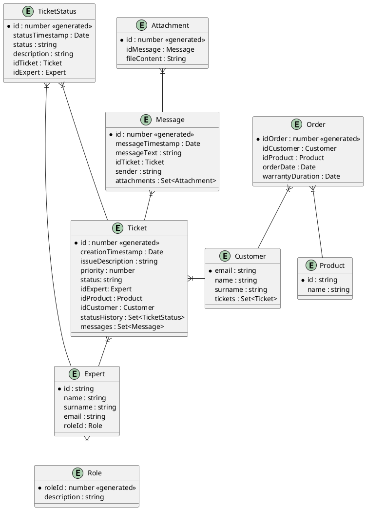

```plantuml
@startuml
entity Ticket {
    *id : number <<generated>>
    creationTimestamp : Date
    issueDescription : string
    priority : number
    status: string
    idExpert: Expert
    idProduct : Product
    idCustomer : Customer
    statusHistory : Set<TicketStatus>
    messages : Set<Message>
}

entity Customer {
    *email : string
    name : string
    surname : string
    tickets : Set<Ticket>
}

entity Expert {
    *id : string 
    name : string
    surname : string
    email : string
    roleId : Role
}

entity Role {
    *roleId : number <<generated>>
    description : string
}

entity Product {
    *id : string
    name : string
}

entity Order {
    *idOrder : number <<generated>>
    idCustomer : Customer
    idProduct : Product
    orderDate : Date
    warrantyDuration : Date 
}

entity TicketStatus {
    *id : number <<generated>>
    statusTimestamp : Date
    status : string
    description : string
    idTicket : Ticket
    idExpert : Expert
}

entity Message {
    *id : number <<generated>>
    messageTimestamp : Date
    messageText : string
    idTicket : Ticket
    sender : string
    attachments : Set<Attachment>
}

entity Attachment {
    *id : number <<generated>>
    idMessage : Message
    fileContent : String
}

Ticket }|- Customer
Ticket }|-- Expert
Message }|-- Ticket
Order }|-- Product
Order }|-- Customer
Attachment }|-- Message
TicketStatus }|---- Expert
TicketStatus }|--- Ticket
Expert }|-- Role

@enduml
```