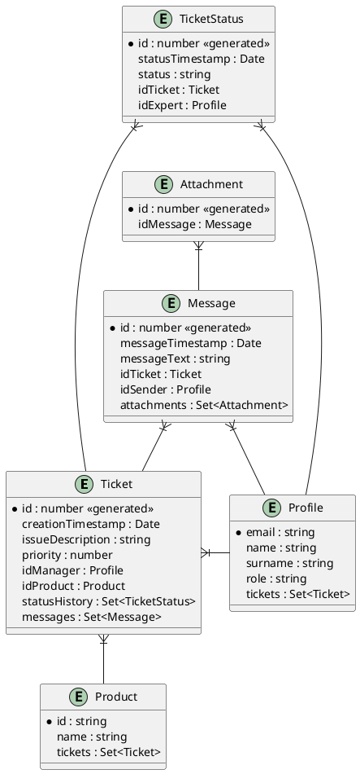

```plantuml
@startuml
entity Ticket {
    *id : number <<generated>>
    creationTimestamp : Date
    issueDescription : string
    priority : number
    idManager : Profile
    idProduct : Product
    statusHistory : Set<TicketStatus>
    messages : Set<Message>
}

entity Profile {
    *email : string
    name : string
    surname : string
    role : string
    tickets : Set<Ticket>
}

entity Product {
    *id : string
    name : string
    tickets : Set<Ticket>
}

entity TicketStatus {
    *id : number <<generated>>
    statusTimestamp : Date
    status : string
    idTicket : Ticket
    idExpert : Profile
}

entity Message {
    *id : number <<generated>>
    messageTimestamp : Date
    messageText : string
    idTicket : Ticket
    idSender : Profile
    attachments : Set<Attachment>
}

entity Attachment {
    *id : number <<generated>>
    idMessage : Message
}

Ticket }|- Profile
Ticket }|-- Product
Message }|-- Ticket
Message }|-- Profile
Attachment }|-- Message
TicketStatus }|---- Profile
TicketStatus }|--- Ticket

@enduml
```